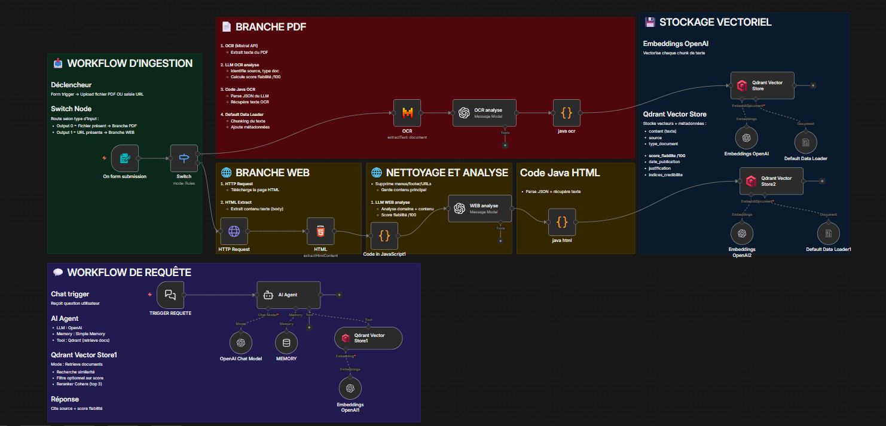
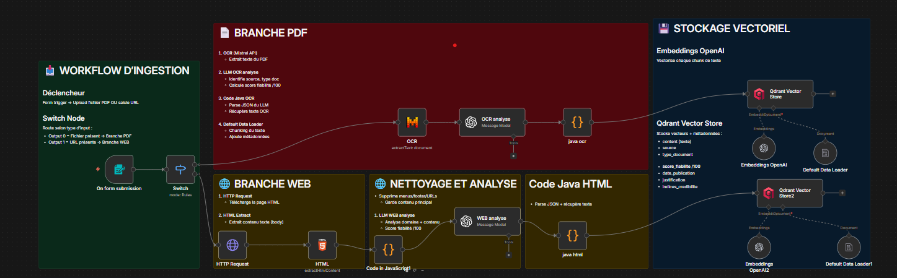
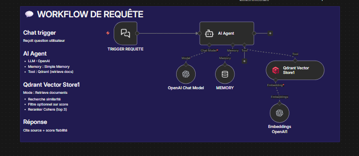
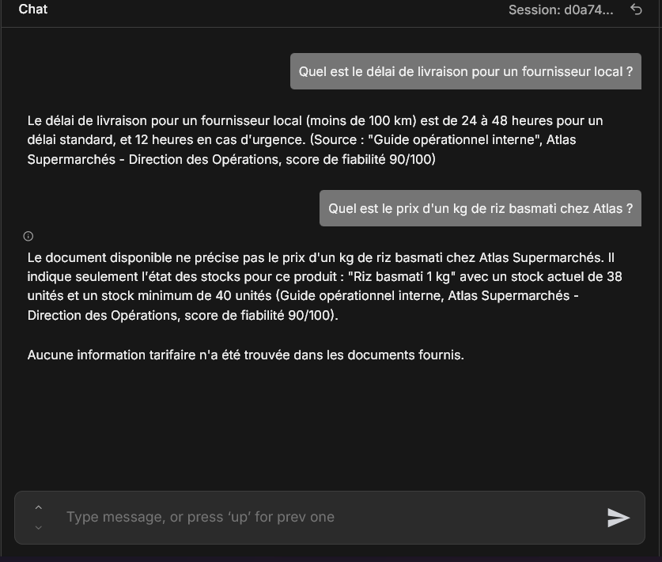

# RAG Workflow (n8n) - Fiabilite, Sources, Traçabilite

Un pipeline RAG end-to-end qui transforme des PDFs et pages web en connaissances fiables et interrogeables. Chaque reponse est justifiee par des sources, un type de document, et un score de fiabilite.



## Valeur

- Fiabilite explicite: chaque document est score et trace.
- Reponses sans hallucination: l'agent s'appuie uniquement sur Qdrant.
- Ingestion multi-sources: PDF (OCR) et Web dans un seul flux.
- 100% self-hosted: n8n + Qdrant + OCR + LLM.

Use case agence: deploiement rapide d'un RAG pour procedures internes clients (retail, logistique, operations) avec preuve de source et score de fiabilite pour prise de decision.

## Architecture

### 1) Ingestion (PDF + Web)



Flux PDF:

- OCR du document
- Analyse LLM: source, type, date, score
- Chunking + metadata
- Embeddings + stockage Qdrant

Flux Web:

- HTTP fetch + extraction HTML
- Nettoyage texte
- Analyse LLM: source, type, date, score
- Chunking + metadata
- Embeddings + stockage Qdrant

### 2) Requete (Chat RAG)



- Chat trigger
- AI Agent avec outil Qdrant (retrieve)
- Reponse contrainte: score de fiabilite + source + type

## Fonctionnalites

- OCR pour PDF (Mistral)
- Scoring de fiabilite par LLM
- Metadata riches: source, type, date, justification
- Vector store Qdrant filtrable par score
- Agent RAG strict: pas d'hallucination

## Tech stack

- n8n
- Qdrant
- OpenAI (embeddings + LLM)
- Mistral (OCR)

## Installation rapide

1. Importer `workflow/rag.json` dans n8n.
2. Creer les credentials:
   - OpenAI API
   - Mistral API
   - Qdrant API
3. Verifier la collection Qdrant (defaut: `RAG ULTIME PISCINE`).
4. Activer les 2 triggers:
   - `On form submission` (ingestion)
   - `TRIGGER REQUETE` (chat)

## Usage

### Ingestion

- Uploader un PDF ou coller une URL dans le formulaire.
- Le document est OCRise, score, puis indexe dans Qdrant.

### Requete

- Poser une question via le chat.
- L'agent repond uniquement avec des passages indexes et cite la fiabilite.

## Exemple de requete



```text
Question:
"Quel est le delai de livraison pour un fournisseur local ?"

Reponse (format attendu):
- Le delai standard est de 24 a 48 heures, et 12 heures en cas d'urgence.
  Source: Guide operationnel interne, Atlas Supermarches - Direction des Operations
  Type: Guide operationnel
  Score: 90/100

Question:
"Quel est le prix d'un kg de riz basmati chez Atlas ?"

Reponse (format attendu):
- Le document disponible ne precise pas le prix. Il indique seulement l'etat des stocks pour "Riz basmati 1 kg".
  Source: Guide operationnel interne, Atlas Supermarches - Direction des Operations
  Type: Guide operationnel
  Score: 90/100
- Aucune information tarifaire n'a ete trouvee dans les documents fournis.
```

## Structure du repo

```
.
├─ README.md
├─ workflow/
│  └─ rag.json
└─ assets/
   ├─ rag.png
   ├─ rag-ingestion.png
   ├─ rag-requete.png
   └─ chat.png
```

## Notes

- Les scores de fiabilite sont generes par LLM et doivent etre ajustes selon votre contexte.
- Filtrer les contenus trop courts ou non fiables avant indexation augmente la qualite.
